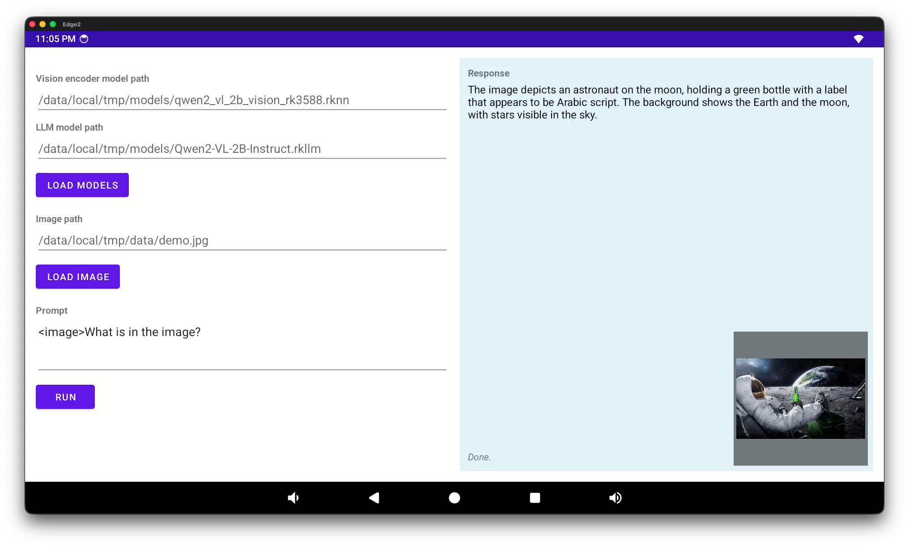

# VLM RKNN

This repo contains a starter CMake project for running Qwen-VL style vision-language models on Rockchip devices via RKNN/RKLLM.

Currently supports the following models:

* Qwen-VL2
* SmolVLM2

Others are in development:

* Llama
* Qwen-VL2.5
* Qwen-VL3

### Contents

* [Background](#background)
  * [Qwen](#qwen)
  * [Qwen-VL](#qwen-vl)
* [Project Structure](#project-structure)
  * [Layout](#layout)
  * [Dependencies](#dependencies)
* [Linux CLI](#linux-cli)
  * [CMake Configuration](#cmake-configuration)
* [HTTP Server](#http-server)
  * [Configuration File](#configuration-file)
  * [Endpoints](#endpoints)
* [Android 14](#android-14)
  * [Test Frontend](#test-frontend)
  * [APK Installation](#apk-installation)
* [Models](#models)
  * [Qwen2-VL-2b](#qwen2-vl-2b)
  * [Qwen2-VL-7b](#qwen2-vl-7b)
* [Contributing](#contributing)
* [License](#license)

## Background

VLM is short for "Vision-Language Model". This refers to a model that accepts input in the form of images, text, and sometimes video. This makes the model _multimodal_. Although a range of inputs are accepted, the output will generally be text.

Common applications include describing or answering questions about images, reading text in screenshots or documents, and parsing graphical user interfaces.

This project was originally built around QwenVL models, and later expanded to include SmolVLM and Llama models.

### Qwen

Qwen is a family of open-weight large language models from Alibaba's Tongyi team, released under permissive licences and widely used as a base for downstream fine-tuning and on-device deployment.

### Qwen-VL

Qwen-VL extends Qwen with a vision encoder, producing a multimodal model that takes images and text as input and emits text. Qwen-VL models are extensions of corresponding Qwen base models:

| Model      | Description                                       |
|------------|---------------------------------------------------|
| Qwen       | Alibaba’s LLM family                              |
| Qwen-VL    | Qwen with vision-language capability              |
| Qwen2-VL   | Newer vision-language generation                  |
| Qwen2.5-VL | Stronger newer generation                         |
| Qwen3-VL   | Later generation with further multimodal upgrades |

## Project Structure

This project targets Rockchip Linux and Android devices based on the Rockchip RK3588. CMake is used for both platforms.

### Layout

- `android/` - Gradle Android test frontend and app module.
- `cmake/` - CMake helper modules (e.g. third-party fetch configuration).
- `cpp/` - C++ library sources and CLI entry point.
- `scripts/` - Linux and Android build helper scripts.
- `thirdparty/` - Bundled RKNN and RKLLM headers and prebuilt runtime libraries.
- `CMakeLists.txt` - CMake build configuration.
- `Dockerfile.android` - Android NDK build environment.
- `Dockerfile.native` - Linux/aarch64 cross-build environment.
- `docker-compose.yml` - Convenience services for the development containers.

### Dependencies

OpenCV is being integrated as a fetched third-party dependency for image loading and preprocessing. The initial CMake integration builds a small OpenCV module set (`core,imgproc,imgcodecs`) by default.

## Linux CLI

To build the CLI for Linux, use the `build-native.sh` wrapper script:

```bash
./scripts/build-native.sh docker
```

Once built, copy the binary to your device, along with the required RKNN library files.

```bash
scp build-native/vlm-rknn <ip>:<path>
```

Run the CLI with named model and input arguments:

```bash
./vlm-rknn \
  --model-family qwen2-vl \
  --vision /path/to/qwen2_vl_vision.rknn \
  --llm /path/to/Qwen2-VL-Instruct.rkllm \
  --image data/cell.png \
  --prompt "<image>What is in the image?"
```

For this example, you will need to download `qwen2_vl_vision.rknn` and `Qwen2-VL-Instruct.rkllm`. See the [Models](#models) section below for details.

### CMake Configuration

RKNN and RKLLM headers and runtime libraries can be found under `thirdparty/rknpu2` and `thirdparty/rkllm` respectively.

Override the defaults using one or more of the following when invoking CMake:
* `-DRKNN_INCLUDE_DIR`
* `-DRKNN_RUNTIME_LIB`
* `-DRKLLM_INCLUDE_DIR`
* `-DRKLLM_RUNTIME_LIB`

OpenCV is fetched when configuring CMake. Override the fetched release (default `4.13.0`) with `-DQWEN_VL_RKNN_OPENCV_GIT_TAG=<tag-or-commit>`.

You may also trim or expand the set of modules to be built with `-DQWEN_VL_RKNN_OPENCV_MODULES=<comma-separated-modules>`.

OpenCV sample projects are disabled by default. The default OpenCV image codec configuration keeps PNG and JPEG enabled and disables optional non-PNG/JPEG codecs.

## HTTP Server

In addition to the CLI, this project builds `vlm-rknn-server`, a small HTTP server that exposes models over a JSON API. The server is built for both the native (Linux/aarch64) and Android targets, and is enabled by default. You can disable it with `-DVLM_RKNN_ENABLE_SERVER=OFF`.

Unlike the CLI, the server does not take model arguments on the command line. Models are described in an INI configuration file, and the server is started with `--ini-file`:

```bash
./vlm-rknn-server --ini-file server.ini
```

Other options:

| Option                       | Default   | Description                                                  |
|------------------------------|-----------|--------------------------------------------------------------|
| `--ini-file <path>`          | required  | Path to the INI configuration file describing the models.    |
| `--host <address>`           | `0.0.0.0` | Address to bind.                                             |
| `--port <port>`              | `8080`    | Port to listen on.                                           |
| `--max-loaded-models <n>`    | `1`       | Maximum number of models held in NPU memory at once.         |
| `-v`, `--verbose`            | off       | Enable verbose logging.                                      |

### Configuration File

Each `[model_id]` section defines one model. The section name is the identifier that clients pass as `model_id`, and the first model in the file is the default. The recognised keys mirror the CLI options, with underscores instead of hyphens:

```ini
[qwen2-vl]
model_family=qwen2-vl
vision=/models/qwen2-vl/vision.rknn
llm=/models/qwen2-vl/Qwen2-VL-Instruct.rkllm
max_new_tokens=300

[chat]
model_family=llama
llm=/models/llama/Llama-3.2.rkllm
```

| Key               | Required              | Description                                                       |
|-------------------|-----------------------|-------------------------------------------------------------------|
| `model_family`    | no (default qwen2-vl) | One of `qwen2-vl`, `qwen2.5-vl`, `qwen3-vl`, `llama`, `smolvlm2`. |
| `vision`          | vision models only    | Path to the vision encoder (`.rknn`).                             |
| `llm`             | yes                   | Path to the language model (`.rkllm`).                            |
| `max_new_tokens`  | no (default 128)      | Maximum tokens to generate.                                       |
| `max_context_len` | no (default 2048)     | Maximum context length.                                           |
| `cores`           | no                    | Number of NPU cores to use (1-3).                                 |

The default model is loaded eagerly when the server starts. Other models are loaded on demand the first time they are requested. At most `--max-loaded-models` models are kept resident in NPU memory. When a new model must be loaded and the cache is full, the least recently used model is evicted.

A complete example is provided in [`data/server.example.ini`](./data/server.example.ini).

### Endpoints

| Method | Path       | Description                                            |
|--------|------------|--------------------------------------------------------|
| `GET`  | `/health`  | Returns `{"ready": <bool>}` for the default model.     |
| `GET`  | `/models`  | Returns the configured model ids and the default.      |
| `POST` | `/query`   | Runs a query. See the request format below.            |

A `/query` request body is a JSON object:

```json
{
  "model_id": "qwen2-vl",
  "prompt": "<image>What is in the image?",
  "image": "data/cell.png"
}
```

The `model_id` attribute is optional and selects which configured model to use, defaulting to the first model in the INI file. The `image` attribute is required only when `prompt` contains the model's image placeholder. On success the response is `{"text": "..."}`; errors are returned as `{"error": "..."}` with an appropriate status code.

## Android 14

To build the CLI for Android 14, use the `build-android.sh` wrapper script:

```bash
./scripts/build-android.sh docker
```

The Android helper expects the NDK from the Android container or an `ANDROID_NDK_HOME` path supplied by the caller.

### Test Frontend

This project also includes a test frontend for Android.



Build the Android test frontend APK using Gradle:

```bash
cd android
./gradlew :app:assembleDebug
```

The debug APK is written to `android/app/build/outputs/apk/debug/app-debug.apk`.

The app packages the vendored Android RKNN/RKLLM runtime libraries from `thirdparty/rknpu2/lib-android` and `thirdparty/rkllm/lib-android`. To override those paths, set `rknnLibRoot` and `rkllmLibRoot` in `android/local.properties`, or use `RKNN_LIB_ROOT` and `RKLLM_LIB_ROOT` environment variables.

### APK Installation

First use ADB to connect to your device:

```bash
adb connect <IP>
```

Then install the app via Gradle:

```bash
./gradlew :app:installDebug
```

Start the app on your device, or use ADB:

```bash
adb shell am start -n  "com.tristanpenman.vlmrknn/.MainActivity"
```

## Models

### Qwen2-VL-2B

Qwen2-VL is distributed in several sizes, ranging from 2B (2 billion parameters) to 7B and 72B parameters. I recommend starting with the 2B model, which weighs in at about 4.5GB. This fits with plenty of room to spare on a 16GB device, such as the Khadas Edge2.

You can download compatible Qwen2-VL models from Hugging Face:

👉 [Qwen2-VL-2B-rkllm](https://huggingface.co/3ib0n/Qwen2-VL-2B-rkllm)

Fetch the `Qwen2-VL-2B-Instruct.rkllm` and `qwen2_vl_2b_vision_rk3588.rknn` model files.

### Qwen2-VL-7B

Alternatively, you can fetch the 7B version. This weighs in at around 9.6GB. These can also be fetched from Hugging Face:

👉 [Qwen2-VL-7B-rkllm](https://huggingface.co/3ib0n/Qwen2-VL-7B-rkllm)

Fetch the `Qwen2-VL-7B-Instruct.rkllm` and `qwen2_vl_7b_vision_rk3588.rknn` model files.

## Contributing

Contributions are welcome. I will make an effort to review any bona fide contributions.

You are also welcome to raise GitHub issues against this repo, however please note this is merely a hobby project. I cannot offer any guarantee that issues will be responded to in a timely fashion.

## License

This code is released under the Apache License 2.0.

See the [LICENSE](./LICENSE) file for more information.
